# AF Enhanced HTML Node - Complete Usage Guide

A ComfyUI Note node with HTML capabilities. Create notes, UI's and ReadMe's directly inside the workflow using rich HTML formatting.


---

## ✨ Key Features

- **Rich HTML Support** - Full HTML formatting with colored sections, lists, tables, code blocks, and more
- **Non-Intrusive Design** - Doesn't interfere with normal ComfyUI workflow interactions
- **Easy Editing** - Double-click anywhere on the content to edit HTML
- **Smart Links** - Ctrl+click to open external links (JavaScript disabled for security)
- **Beautiful Styling** - Predefined color schemes that match ComfyUI's theme
- **Custom HTML Support** - Write your own HTML with inline styles
- **No Dependencies** - All CSS is inlined for reliable performance

---

## 🛠️ Installation

### Via ComfyUI Manager (Recommended)
1. Open ComfyUI Manager
2. Search for "AF - Enhanced HTML Note"
3. Install

### Manual Installation
1. Clone this repository into your `ComfyUI/custom_nodes/` directory:
   ```bash
   git clone https://github.com/alFrame/ComfyUI-AF-Enhanced_HTML_Note.git
	```
	
---

## ⚠️ Disclaimer

This ComfyUI custom node is developed through AI-assisted coding, prompted and directed by a human developer. While considerable care has been taken to ensure proper functionality, security, and compatibility, this software is provided **"as is" without warranty of any kind**, express or implied.

**By using this custom node, you acknowledge that:**
- You install and run this software at your own risk
- The creator is not liable for any damages, data loss, or issues arising from its use
- Compatibility with your specific setup is not guaranteed
- You should test thoroughly in a safe environment before production use

This node has been carefully designed and tested, but individual system configurations may vary. Please report any issues on the GitHub repository.

---

## 🎮 Interaction Guide

### Editing Content
- **Double-click** anywhere on the HTML content to enter edit mode
- **Escape key** or click outside to exit edit mode and save changes
- Changes are automatically saved when exiting edit mode

### Using Links
- **Hold Control key + Click** on any link to activate it
- External links open in new tabs
- JavaScript execution is disabled for security

### Node Management
- **Click and drag** the node title bar to move
- **Drag edges/corners** to resize
- **Middle mouse button** works for canvas panning (like other nodes)

---

## 🎨 Predefined Section Colors

The node comes with several predefined colored section styles. Click each section below to see the code and rendered example.

<details>
<summary><b>🟢 Positive Section (Green)</b></summary>

### Code:
```html
<div class="af-section af-positive">
    <h2>🟢 Positive Prompts</h2>
    <p><strong>masterpiece, best quality, highly detailed</strong></p>
    <ul>
        <li>Professional lighting</li>
        <li>Sharp focus</li>
        <li>8K resolution</li>
    </ul>
</div>
```

### Rendered Result:


</details>

<details>
<summary><b>🔴 Negative Section (Red)</b></summary>

### Code:
```html
<div class="af-section af-negative">
    <h2>🔴 Negative Prompts</h2>
    <p><em>low quality, blurry, distorted</em></p>
    <p><code>nsfw, watermark, signature, bad anatomy</code></p>
</div>
```

### Rendered Result:
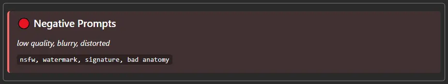

</details>

<details>
<summary><b>📝 Neutral Section (Gray)</b></summary>

### Code:
```html
<div class="af-section af-neutral">
    <h3>📝 Notes</h3>
    <p>General notes and information...</p>
    <ul>
        <li>Item 1</li>
        <li>Item 2</li>
        <li>Item 3</li>
    </ul>
</div>
```

### Rendered Result:


</details>

<details>
<summary><b>ℹ️ Info Section (Light Blue)</b></summary>

### Code:
```html
<div class="af-section af-info">
    <h3>ℹ️ Information</h3>
    <p>Using: <strong>SDXL 1.0</strong></p>
    <p>Steps: <code>25</code> | CFG: <code>7.5</code> | Sampler: <code>DPM++ 2M Karras</code></p>
</div>
```

### Rendered Result:
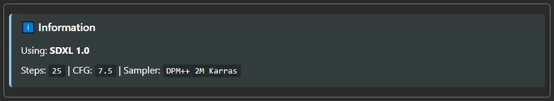

</details>

<details>
<summary><b>⚠️ Warning Section (Yellow)</b></summary>

### Code:
```html
<div class="af-section af-warning">
    <h3>⚠️ Warning</h3>
    <p>This workflow requires:</p>
    <ol>
        <li>High VRAM (8GB+)</li>
        <li>Latest ComfyUI version</li>
        <li>SDXL compatible models</li>
    </ol>
</div>
```

### Rendered Result:
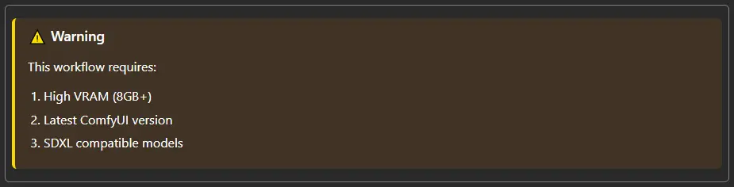

</details>

<details>
<summary><b>💛 Yellow Section (Alternative)</b></summary>

### Code:
```html
<div class="af-section af-yellow">
    <h3>💛 Yellow Section</h3>
    <p>Alternative yellow styled content with different shade...</p>
</div>
```

### Rendered Result:
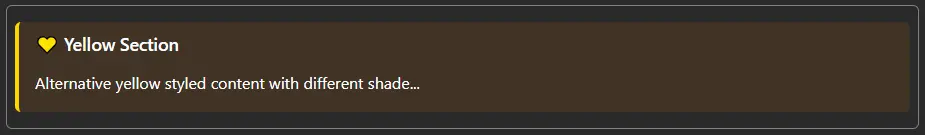

</details>

<details>
<summary><b>🔵 Blue Section (Deep Blue)</b></summary>

### Code:
```html
<div class="af-section af-blue">
    <h3>🔵 Blue Section</h3>
    <p>Deep blue styled content for technical information...</p>
</div>
```

### Rendered Result:


</details>

<details>
<summary><b>🎨 Custom Section (Purple)</b></summary>

### Code:
```html
<div class="af-section af-custom">
    <h3>🎨 Custom</h3>
    <p>Purple custom styled content for special cases...</p>
</div>
```

### Rendered Result:
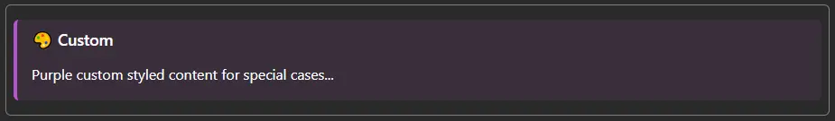

</details>

---

## 📏 Predefined Spacers

Use these spacer classes to control vertical spacing between elements.

<details>
<summary><b>All Spacer Sizes</b> - Click to see examples</summary>

### Code:
```html
<div class="af-section af-positive">Content Block 1</div>

<!-- Top spacer (2px) -->
<div class="af-spacer-top"></div>

<div class="af-section af-negative">Content Block 2</div>

<!-- Mini spacer (4px) -->
<div class="af-spacer-mini"></div>

<div class="af-section af-neutral">Content Block 3</div>

<!-- Small spacer (8px) -->
<div class="af-spacer-small"></div>

<div class="af-section af-info">Content Block 4</div>

<!-- Regular spacer (16px) -->
<div class="af-spacer"></div>

<div class="af-section af-warning">Content Block 5</div>

<!-- Large spacer (32px) -->
<div class="af-spacer-large"></div>

<div class="af-section af-custom">Content Block 6</div>

<!-- Extra large spacer (48px) -->
<div class="af-spacer-xl"></div>

<div class="af-section af-blue">Content Block 7</div>
```

### Rendered Result:
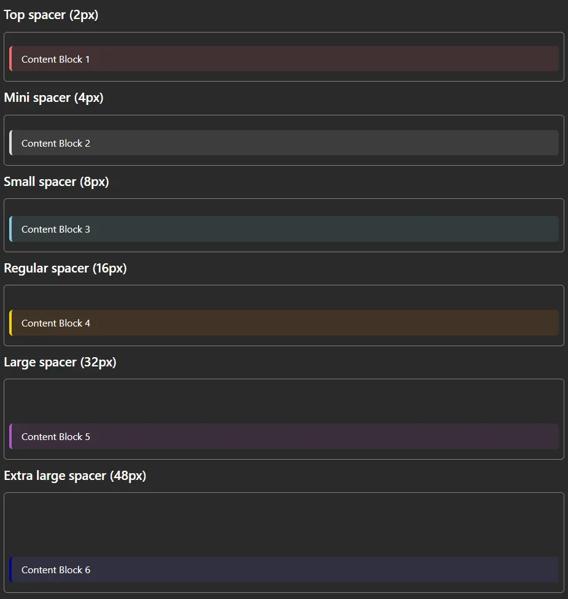

### Size Reference:
- `af-spacer-top` → 2px
- `af-spacer-mini` → 4px
- `af-spacer-small` → 8px
- `af-spacer` → 16px (default)
- `af-spacer-large` → 32px
- `af-spacer-xl` → 48px

</details>

---

## 📐 Column Layouts

Create two-column layouts using the predefined column classes.

<details>
<summary><b>Two-Column Layout Example</b></summary>

### Code:
```html
<div class="row">
    <div class="af-column-half-left">
        <div class="af-section af-positive">
            <h3>🎨 Style Settings</h3>
            <ul>
                <li>Style: Photorealistic</li>
                <li>Aspect: 16:9</li>
                <li>Quality: Ultra High</li>
            </ul>
        </div>
        
        <div class="af-spacer"></div>
        
        <div class="af-section af-info">
            <h3>⚙️ Technical</h3>
            <p>Resolution: <code>1920x1080</code></p>
            <p>Batch: <code>4</code></p>
        </div>
    </div>
    
    <div class="af-column-half-right">
        <div class="af-section af-negative">
            <h3>🚫 Exclusions</h3>
            <ul>
                <li>No text in image</li>
                <li>Avoid oversaturation</li>
                <li>No watermarks</li>
            </ul>
        </div>
        
        <div class="af-spacer"></div>
        
        <div class="af-section af-warning">
            <h3>💡 Tips</h3>
            <p>Use lower CFG for more creative results</p>
        </div>
    </div>
</div>
```

### Rendered Result:
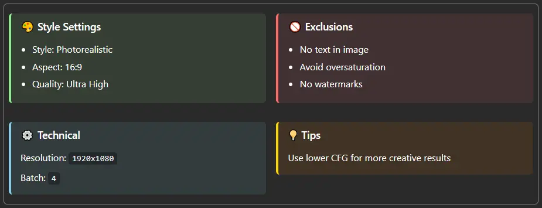

**Note:** The `row` class ensures proper column wrapping, and each column is 49% width with 1% margin.

</details>

---

## 🔗 Clickable Links & Actions

All links require **Ctrl+Click** to activate for safety and to prevent accidental navigation. JavaScript actions work on links when Ctrl+Click is used.

<details>
<summary><b>Link Examples</b></summary>

### Code:
```html
<div class="af-section af-info">
    <h3>🔗 Interactive Links</h3>
    
    <!-- External link (opens in new tab with Ctrl+click) -->
    <p><a href="https://github.com/comfyanonymous/ComfyUI">ComfyUI GitHub Repository</a></p>
    
    <!-- Anchor link (page navigation with Ctrl+click) -->
    <p><a href="#section-name">Jump to section</a></p>
    
    <!-- Mailto link (opens email client with Ctrl+click) -->
    <p><a href="mailto:example@domain.com">Send Email</a></p>
    
    <!-- Relative URL (opens in new tab with Ctrl+click) -->
    <p><a href="docs/page.html">Documentation</a></p>
</div>
```

**Remember:** Hold **Ctrl** while clicking any link to activate it!

### Rendered Result:
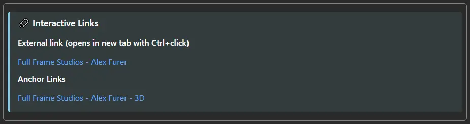

</details>

### Supported Link Types:
- ✅ **External URLs** (`https://`, `http://`) - Open in new tab
- ✅ **Anchor links** (`#section`) - Page navigation  
- ✅ **Mailto links** (`mailto:`) - Open email client
- ✅ **Tel links** (`tel:`) - Open phone app
- ✅ **Relative URLs** - Open in new tab

### Not Supported Link Types:
- ❌ **JavaScript links** (`javascript:`) - Blocked for security
- ❌ **onclick handlers** - Ignored for security

### Security Restrictions:
- **No JavaScript execution** - All JavaScript is blocked for security
- **No `<script>` tags** - Script tags are not executed
- **No external scripts** - Cannot load external JavaScript files
- **Ctrl+Click required** - All link interactions require Control key
- **Safe HTML only** - Only styling and navigation features are supported
- **No DOM manipulation** - JavaScript cannot modify the HTML content
- **No browser storage** - `localStorage` and `sessionStorage` are blocked

---

## 💻 Custom HTML & Inline Styles

The node supports **standard HTML** with **inline CSS styling**. You can write custom HTML just like you would for a webpage.

### ✅ Supported Features

- **All standard HTML tags**: `<div>`, `<span>`, `<p>`, `<h1>`-`<h6>`, `<ul>`, `<ol>`, `<li>`, `<table>`, etc.
- **Inline CSS styles**: Use the `style` attribute on any element
- **Text formatting**: `<strong>`, `<em>`, `<u>`, `<small>`, `<code>`, `<pre>`
- **Lists**: Ordered and unordered lists
- **Tables**: Full table support with styling
- **Horizontal rules**: `<hr>` for dividers
- **Code blocks**: `<code>` and `<pre>` tags

---

## 🎨 Custom Styling Examples

<details>
<summary><b>Custom Spacers with Inline Styles</b></summary>

### Code:
```html
<div class="af-section af-positive">First Section</div>

<!-- Custom 12px spacer -->
<div style="height: 12px;"></div>

<div class="af-section af-negative">Second Section</div>

<!-- Custom 24px spacer -->
<div style="height: 24px;"></div>

<div class="af-section af-info">Third Section</div>

<!-- Custom 50px spacer -->
<div style="height: 50px;"></div>

<div class="af-section af-warning">Fourth Section</div>
```

### Rendered Result:
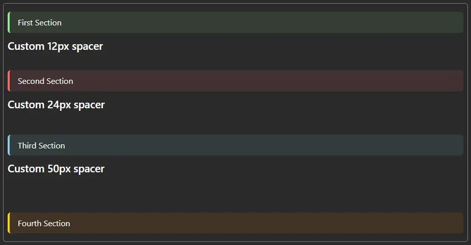

</details>

<details>
<summary><b>Custom Colored Sections</b></summary>

### Code:
```html
<!-- Custom pink section -->
<div style="background: rgba(255, 100, 150, 0.1); border-left: 4px solid #ff6496; padding: 12px; border-radius: 6px; margin: 8px 0;">
    <h3 style="color: #ff6496; margin-top: 0;">Custom Pink Section</h3>
    <p>Your content here with custom colors...</p>
</div>

<!-- Custom teal section -->
<div style="background: rgba(64, 224, 208, 0.1); border-left: 4px solid #40E0D0; padding: 12px; border-radius: 6px; margin: 8px 0;">
    <h3 style="color: #40E0D0; margin-top: 0;">Custom Teal Section</h3>
    <p>Different color scheme for variety...</p>
</div>

<!-- Custom orange section -->
<div style="background: rgba(255, 165, 0, 0.1); border-left: 4px solid #FFA500; padding: 12px; border-radius: 6px; margin: 8px 0;">
    <h3 style="color: #FFA500; margin-top: 0;">Custom Orange Section</h3>
    <p>Create any color combination you need...</p>
</div>
```

### Rendered Result:


</details>

<details>
<summary><b>Custom Text Styling</b></summary>

### Code:
```html
<div class="af-section af-neutral">
    <!-- Large blue bold text -->
    <p style="font-size: 18px; color: #58a6ff; font-weight: bold;">
        Large blue bold text for emphasis
    </p>
    
    <!-- Small gray italic text -->
    <p style="font-size: 12px; color: #888; font-style: italic;">
        Small gray italic text for subtitles
    </p>
    
    <!-- Highlighted text -->
    <p style="background: rgba(255, 255, 0, 0.2); padding: 4px 8px; border-radius: 3px;">
        Highlighted text with yellow background
    </p>
    
    <!-- Custom monospace -->
    <p style="font-family: 'Courier New', monospace; color: #90EE90; background: rgba(0,0,0,0.4); padding: 8px; border-radius: 4px;">
        Custom monospace text for code-like display
    </p>
</div>
```

### Rendered Result:


</details>

<details>
<summary><b>Custom Borders and Boxes</b></summary>

### Code:
```html
<!-- Dashed border box -->
<div style="border: 2px dashed #90EE90; padding: 16px; margin: 10px 0; background: rgba(0, 0, 0, 0.2); border-radius: 8px;">
    <p><strong>Dashed Border Box</strong></p>
    <p>Content in a custom dashed border box</p>
</div>

<!-- Solid border with shadow effect -->
<div style="border: 2px solid #58a6ff; padding: 16px; margin: 10px 0; background: rgba(88, 166, 255, 0.05); box-shadow: 0 4px 8px rgba(0,0,0,0.3); border-radius: 8px;">
    <p><strong>Solid Border with Shadow</strong></p>
    <p>Creates depth with shadow effect</p>
</div>

<!-- Thick left border -->
<div style="border-left: 8px solid #BA55D3; padding: 16px; margin: 10px 0; background: rgba(186, 85, 211, 0.1);">
    <p><strong>Thick Left Border</strong></p>
    <p>Emphasizes content with thick accent border</p>
</div>
```

### Rendered Result:


</details>

<details>
<summary><b>Custom Layouts and Alignment</b></summary>

### Code:
```html
<!-- Centered content -->
<div style="text-align: center; padding: 20px; background: rgba(255,255,255,0.05); border-radius: 8px; margin: 10px 0;">
    <h2 style="margin: 0 0 12px 0;">Centered Title</h2>
    <p style="margin: 0;">Centered paragraph text for announcements</p>
</div>

<!-- Right-aligned content -->
<div style="text-align: right; padding: 10px; border-top: 1px solid #555; margin-top: 20px;">
    <small style="color: #888;">Right-aligned footer note</small>
</div>

<!-- Flex layout for inline elements -->
<div style="display: flex; gap: 10px; align-items: center; padding: 12px; background: rgba(0,0,0,0.2); border-radius: 6px;">
    <span style="background: #90EE90; color: #000; padding: 4px 8px; border-radius: 4px; font-weight: bold;">Tag 1</span>
    <span style="background: #58a6ff; color: #fff; padding: 4px 8px; border-radius: 4px; font-weight: bold;">Tag 2</span>
    <span style="background: #FFA500; color: #fff; padding: 4px 8px; border-radius: 4px; font-weight: bold;">Tag 3</span>
</div>
```

### Rendered Result:
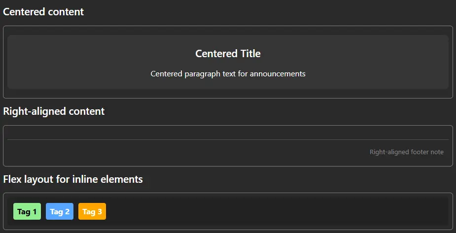

</details>

<details>
<summary><b>Custom Info Cards</b></summary>

### Code:
```html
<div style="display: flex; gap: 10px; flex-wrap: wrap;">
    <div style="flex: 1; min-width: 150px; background: rgba(144, 238, 144, 0.1); border: 1px solid #90EE90; padding: 12px; border-radius: 6px; text-align: center;">
        <strong style="color: #90EE90; display: block; margin-bottom: 4px;">Steps</strong>
        <p style="margin: 0; font-size: 24px; color: #fff; font-weight: bold;">25</p>
    </div>
    
    <div style="flex: 1; min-width: 150px; background: rgba(135, 206, 235, 0.1); border: 1px solid #87CEEB; padding: 12px; border-radius: 6px; text-align: center;">
        <strong style="color: #87CEEB; display: block; margin-bottom: 4px;">CFG Scale</strong>
        <p style="margin: 0; font-size: 24px; color: #fff; font-weight: bold;">7.5</p>
    </div>
    
    <div style="flex: 1; min-width: 150px; background: rgba(186, 85, 211, 0.1); border: 1px solid #BA55D3; padding: 12px; border-radius: 6px; text-align: center;">
        <strong style="color: #BA55D3; display: block; margin-bottom: 4px;">Batch Size</strong>
        <p style="margin: 0; font-size: 24px; color: #fff; font-weight: bold;">4</p>
    </div>
</div>
```

### Rendered Result:
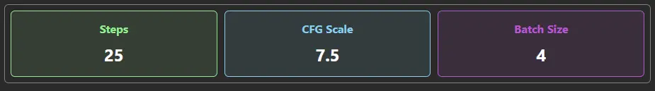

</details>

---

## 📋 Complete Workflow Example

<details>
<summary><b>Full Workflow Documentation Template</b></summary>

### Code:
```html
<div class="af-section af-positive">
    <h2>🟢 Positive Prompts</h2>
    <p><strong>masterpiece, best quality, highly detailed, 8k uhd, professional photography</strong></p>
    <ul>
        <li>Professional lighting and composition</li>
        <li>Sharp focus with bokeh background</li>
        <li>Photorealistic textures and materials</li>
        <li>Award-winning cinematography</li>
    </ul>
    <a href="https://example.com/prompts">📋 View Prompt Guide</a>
</div>

<div class="af-spacer"></div>

<div class="af-section af-negative">
    <h2>🔴 Negative Prompts</h2>
    <p><em>low quality, worst quality, blurry, out of focus</em></p>
    <p><code>nsfw, watermark, signature, text, bad anatomy, deformed, ugly, mutation</code></p>
</div>

<div class="af-spacer-large"></div>

<div class="af-section af-info">
    <h3>ℹ️ Model Information</h3>
    <p>Model: <strong>SDXL 1.0 Base</strong></p>
    <p>Settings: Steps <code>25</code> | CFG <code>7.5</code> | Sampler <code>DPM++ 2M Karras</code></p>
    <p>Resolution: <code>1024x1024</code> | Batch Size: <code>4</code></p>
    <a href="https://huggingface.co/stabilityai/stable-diffusion-xl-base-1.0">📦 Model Page</a>
</div>

<div class="af-spacer"></div>

<div class="af-section af-warning">
    <h3>⚠️ System Requirements</h3>
    <p>This workflow requires:</p>
    <ol>
        <li>GPU with 8GB+ VRAM (12GB recommended)</li>
        <li>ComfyUI latest version</li>
        <li>SDXL compatible checkpoint</li>
        <li>Required custom nodes installed</li>
    </ol>
</div>

<div class="af-spacer"></div>

<div class="af-section af-neutral">
    <h3>📝 Workflow Notes</h3>
    <p><strong>Tips for best results:</strong></p>
    <ul>
        <li>Verify image dimensions before generating</li>
        <li>Lower CFG (6-7) for more creative interpretations</li>
        <li>Higher CFG (8-10) for more prompt adherence</li>
        <li>Save your workflow frequently!</li>
    </ul>
    <hr>
    <p><small>Last updated: 2025-01-15 | Created with AF Enhanced HTML Node v0.0.5</small></p>
</div>
```

### Rendered Result:


</details>

---

## 🐛 Troubleshooting

<details>
<summary><b>Common Issues and Solutions</b></summary>

### Node won't select/move?
**Solution:** Click on the node's title bar or edges, not the HTML content area

### Links not working?
**Solution:** Remember to hold the **Control key** while clicking links

### JavaScript not working?
**Solution:** JavaScript execution is disabled for security. Only standard navigation links work.

### Can't edit content?
**Solution:** Double-click directly on the HTML content (not the node borders)

### Scrollbar appears unnecessarily?
**Solution:** The node has minimal padding; resize if you need more space

### Styling not applying?
**Solution:**
- Use inline styles with the `style` attribute
- Check for CSS syntax errors in your inline styles
- Predefined classes must be spelled exactly as documented

### Content not saving?
**Solution:** 
- Press **Escape** or click outside to exit edit mode
- Ensure you're not just closing the browser/tab
- Save your ComfyUI workflow after making changes

</details>

---

## 📚 Quick Reference

### Predefined Color Classes
| Class | Color | Use Case |
|-------|-------|----------|
| `af-positive` | Green | Positive prompts, success messages |
| `af-negative` | Red | Negative prompts, errors, warnings |
| `af-neutral` | Gray | General notes, neutral information |
| `af-info` | Light Blue | Information, technical details |
| `af-warning` | Yellow | Warnings, cautions |
| `af-yellow` | Yellow | Alternative yellow styling |
| `af-blue` | Deep Blue | Technical information |
| `af-custom` | Purple | Custom content, special cases |

### Predefined Spacer Classes
| Class | Height | Use Case |
|-------|--------|----------|
| `af-spacer-top` | 2px | Minimal spacing |
| `af-spacer-mini` | 4px | Tiny spacing |
| `af-spacer-small` | 8px | Small spacing |
| `af-spacer` | 16px | Default spacing |
| `af-spacer-large` | 32px | Large spacing |
| `af-spacer-xl` | 48px | Extra large spacing |

### Column Layout Classes
| Class | Width | Use Case |
|-------|-------|----------|
| `af-column-half-left` | 49% | Left column in two-column layout |
| `af-column-half-right` | 49% | Right column in two-column layout |
| `row` | Container | Wrap around columns for proper layout |

### Keyboard Shortcuts
| Shortcut | Action |
|----------|--------|
| **Double-click** | Enter edit mode |
| **Escape** | Exit edit mode and save |
| **Ctrl+Click** | Activate links (JavaScript disabled) |

---

## 📞 Support & Credits

- **Creator:** Alex Furer
- **Co-Creators:** Claude AI & DeepSeek
- **GitHub:** [ComfyUI_AF_FindNodeByID](https://github.com/alFrame/ComfyUI_AF_FindNodeByID)
- **License:** MIT License
- **Version:** 0.0.5